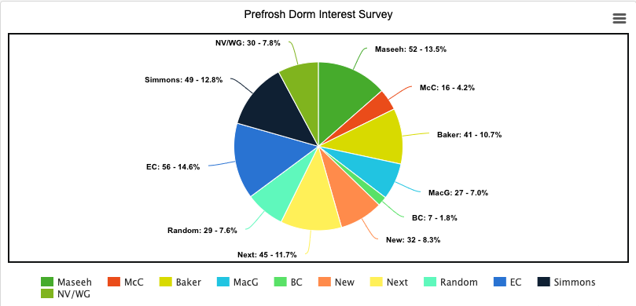

# DormCon Updates 4.15.2021

## Tech Chair

The new dormcon site has more stuff\! Like our meeting notes now\! The only
thing left to do is copy the important documents to the new site.

You can see it here: <https://dormcon.camk.co>

Update 04.21.2021:

- new dormcon website repo has been moved to a new GitHub organization
  mit-dormcon, which I administer: <https://github.com/mit-dormcon>
- new site is mostly complete, once I have approval, I can work with is\&t to
  link it to dormcon.mit.edu

## JudComm

I plan to think through some different ways to make elections run smoother over
the weekend and will put forward those thoughts next week or the week after.

## i3/RAC

I met with Zach and the Guide to Residences team yesterday briefly. I'll be
setting up i3 submissions stuff this week, and also will send an email with this
info but if anyone has updates to the Guide to Residences website that should go
to them soon.

## Dining

- working of getting reusable utensils to people
- working with waste watchers on posters for dorms
- working to encourage turnout to dining meetings

Sarah’s notes from the dining meeting Friday morning:

- Dining is interested in running a pilot in Lobdell (2nd floor of the stud)
  partnering with Commonwealth Kitchen, a nonprofit food incubator that
  prioritizes helping BIPOC-owned businesses
- 3 businesses would be picked to serve as the main vendors in Lobdell for the
  next academic year, 7 additional smaller businesses would have their
  food/beverages sold through the kiosks maintained by these vendors
- Advisory group to help pick vendors \- this is on a very tight timeline
  because they need essentially 3-4 months to prepare the space and communicate
  with businesses, but they should discuss this also at the next DSL Office
  Hours

## Execest \+ Housing

Met with Suzy, Liz, Judy, and David on Tuesday to talk survey and REX

Mostly just starting to think through what a 2 day sophomore experience might
look like if it were going to happen and what sophomores would want to do (+how
much coordination this takes with offices outside DSL), timeline on survey

We’re hoping to have the survey out as soon as possible, meeting again on Friday
to discuss the survey with a greater group of people from HRS & URL and REX/2nd
move with a different group of people from HRS & URL

Reviewing a tentative timeline of when sophomores move in & other logistics like
when they get their building assignments

- Bit of a challenge because none of the 2023s really moved off campus and are
  still eligible to live in the dorms, so there’s like some challenge in making
  sure that all of the dorms have enough space to support first year classes.
  They are working with FSILGs to figure out their timeline on that side of
  things

Friday update: we discussed the timeline in a little bit more detail, there will
probably be different groups dealing with the sophomore experience planning,
logistics of REX & FYRE, and move day specifically

## CPW/REX Chair

- We asked prefrosh what dorms they are interested in and why. Results (note:
  some prefrosh said 2 or 3 different dorms)
  
    - Common reasons:
        - I have friends there/I know someone there
        - Culture/Vibes
        - Location/The River
        - Meal plan (both want and don’t want)
        - Cats
        - Facilities (ex. makerspaces)
        - Building is pretty
        - Room structure (has doubles, has singles, suites)
        - Athletes
        - Why not
        - I don’t know
        - Really cool
        - Sponge
        - Yale dorm
