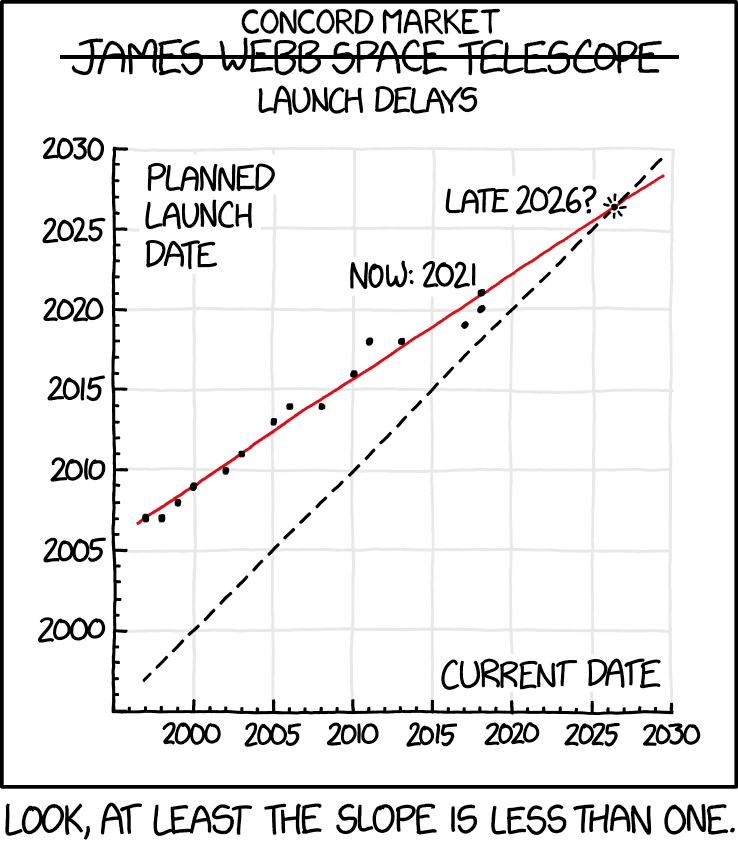
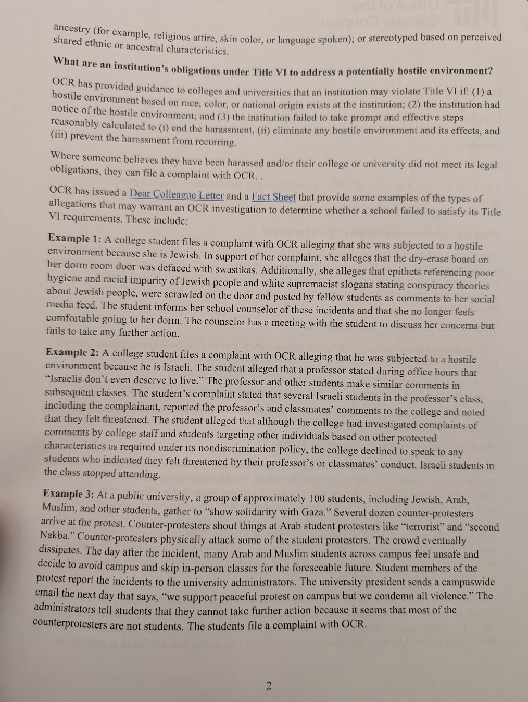

# DormCon GBM 02/13/2025

Date: 02/13/2025  
Location: Simmons party room  
Attendees:

:::note

If you find any issues with the meeting minutes, please email
<dormcon-secretary@mit.edu>

:::

## TL;DR (will be created after the meeting)

- [Dormcon DTYD proposal](https://docs.google.com/presentation/d/13Y6LRTVNt80i_DTOpLUGhMPEcitSlH_ZzEwxeouKizk/edit?fbclid=IwY2xjawIaAvdleHRuA2FlbQIxMAABHU1vGWHzWF0APr0Cy51sb_z0OmqQsVU442PsOOfjm7Ycr1pSvZ8sob1hwQ_aem_xapcUUj4BHNe6hMefo48qQ#slide=id.p)
- [Proposed Eligibility Amendment](https://docs.google.com/document/d/1sBSsSMccCTVfuIO2uY_W-EvMGzUPfh1xQ7LxHcgBmNA/edit?fbclid=IwZXh0bgNhZW0CMTEAAR3HMhBiA7lWuZoesCBloxhgzZFEWdB5lLTxCiW9Q9xxH1P--DjxkY1JkFc_aem_JvcUtKKG_0HNAnU2vyjIug&tab=t.0#heading=h.pporaatx8o8s)

## Full Minutes

### Introductions\!\! new people :)

- Jordan \- DormCon prez, senior, off-campus, affiliated with EC, Material
  Science
- Ananda \- she/her \- senior in 1-12 \- DormCon VP
- Paola \- New House co-prez \- other is Zavian \- Course 12, junior
- Helena \- junior \- mech-e, maseeh prez
- Leo \- senior \- course 8+old 6-2, Next, was Next prez, now Zakiya, DormCon
  treasurer
- Ella \- she/her, new co-prez of Random, Course 8 and some 12
- Camila \- baker prez \- year 2, course 6-3
- Michaela, she/her, sophomore, 5-7, prez at Vassar
- Jackson, he/him, frosh, majoring in 17, co-prez of Simmons and i3 chair
- Noura \- co-prez of McCormcik
- Farin \- dormcon housing chair, 6-7
- Sandra \- course 2 \- 2026, she/her, co-prez McCormick
- Tyler \- senior in Course 2, former MacGregor prez, current JudComm chair
- Gabriel \- sophomore \- Course 6 \- DormCon CPW chair
- Amanda \- dormcon advisor
- Jamie \- UC rep, frosh, 6-3 18
- Julia \- junior course 2, BC, she/her
- Fernando \- course 22, junior, BC
- Geoffrey \- junior, course 20, next house, other JudComm chair, he/him
- Zakiya \- prez of Next House \- sophomore in 10B
- Temkin \- housing chair, 2026, 6-3 and 11, Simmons \+ EC, he/they
- Gabriel \- senior \- 11-6, tech chair and dining chair, he/him
- Daniel \- he/him \- CMS major, other dining chair
- Hanu \- they/he, prez of EC
- Cindy \- our mascot \- named after Cynthia Barnhart

Intro to DormCon\!

- DormCon meets every 2 weeks at GBM, everyone on dormcon-announce, there will
  be emails about all the GBMs
- Presidents’ Retreat is happening\!\!
    - 11-3 on Monday, President’s Day Presidents’ Party
    - we are keeping it shorter at only 4 hours, trying to keep it relevant and
      quick
    - learning things about how to be dorm prez
    - there will be lots of food \- _lunch and snacks_
    - fill out the form even if not coming\! will hopefully be helpful
    - DormCon is here to build bridges, connect dorms, etc.
- structure: start with exec updates, end with presidents’ updates, agenda items
  in the middle

### Exec updates

- Dining chairs
    - Concord Market opening delayed to mid-March \- the fire suppression system
      has a problem 🙁
        - bumping feedback form\!
        - 
    - Food from Home \- people submit recipes to dining halls, and dining makes
      them
        - Lunar New Year happened, lots of feedback, people filled out form,
          feedback went to dining, then to Bon Appetit, to make it better next
          time
        - planning to run again \- maybe a Caribbean night?
        - Stud Dunkin officially taking mobile orders, rewards points, gift
          cards\!
    - New signage at Maseeh
        - promotes DoingWell website, food security resources, etc. \-
          applicable to people in dining hall? because a lot of it has to do
          with, like, time to CFY
    - feedback form for Next House \- reaching out for specifics on who it’s
      going to go to, etc.
        - Next Dining sent a feedback form to next-forum, goal is to connect
          them with Mark and Heather, who are in charge of MIT Dining (along
          with Amanda)
            - Mark is retiring\!
    - planning to print more feedback forms for dining halls?
        - most responses from dormspam
        - will dormspam periodically
- Tech Chair
    - have updated website, has all GBMs for semester\!\!
    - might add section with, like, how to make mailing lists
    - looking for replacement tech chair to have more time for dining chair/etc.
        - election will be held at the next GBM
        - drag along your dorm tech chairs
        - having one position lets you also do random stuff with DormCon
            - “be really good at being a tech chair. or be mediocre at being a
              tech chair. I’m not your mom.” \- Jordan
- Housing Chair
    - they meet with HRS (mit housing) and RCL (residential and community life
      \- area directors et. al.)
    - Fire Day is happening
        - will be smoking up a floor in BC, and other fire day activities™
        - meeting about funding soon
    - feedback on StarRez to Helen Wang, who is a BIG FAN
    - RCL hired floating AD, who will do both programming and take over ADs who
      go on leave, renovations, etc.
    - lots of things about McCormick renovations, which aren’t relevant anymore
    - meeting with HRS tomorrow
        - they’ve started designing a new website, if you have feedback on color
          palettes/timelines/web dev, send, and become tech chair\!
    - should discuss McCormick
        - it’s getting delayed renovation
        - they were told Tuesday around noon, general feedback was shared around
          Wednesday at noon, it was pretty sudden, McCormick residents were
          emailed around 2 or 3pm on Tuesday
            - As soon as they tell anyone, “the cat is not in the bag”
        - delayed by an academic year
        - dorms likely to not be at capacity
            - good, but means less $$
        - they’re maybe going to get new McCormick news tomorrow
            - we want an email. an email is wanted. email.
        - what is fire day?
            - in 2018 and 2019, East Campus demonstration about fire safety,
              smoked up a floor, let students play with fire hose and stuff, let
              you put on the uniform, CPR trainings, etc., obviously didn’t
              happen in 2020
            - excitement\!\!
            - will smoking up a floor make people not put their bikes in the
              hallway??
        - Regular fire, not FYRE
- Secretary
    - GBM schedule for the semester set, sent out over email \+ there is a
      gcal\!\!\!
    - RSVP for retreat has been sent out, please fill it out\!\!\!
    - Guest list for GBMs has been updated for everyone new on the prez lists \+
      exec
        - If you're not in it let us know and we can add it
        - [2024-2025 GBM Guest List](https://docs.google.com/spreadsheets/d/172boIYkWx-cP10uqlb-dZ7RW7UPghtO9JDV31nhf2kE/edit?usp=sharing)
- JudComm
    - for new dorm prezes: DormCon has a Constitution\!\! we follow it as much
      as we can\!\!
    - we have come into a situation, twice, may have been lapsing in our
      adherence to the Constitution
- Underclassmen Rep
    - Eugenie was going to meet with Mark and Heather about Stata meal swipe
      survey results \- getting meal swipes available at Stata
        - an hour before, they cancelled
        - next week is weird because Presidents’ Day
        - meeting them in 2 weeks\!\!
    - Jamie might be revising the Instagram account \- so true\!\!
        - mit_dormcon
        - “we’re hip and cool with the kids”
- Amanda
    - floating AD will be covering for BC, their AD going on leave
- CPW
    - email went out yesterday \- document with all the deadlines, relevant info
      for dorm CPW chairs, went to dorm prezes and CPW chairs
    - if you haven’t elected CPW chairs, do it\!\!
    - if you want extra events, has to get in by February 28
    - document is beautiful\!\!
- i3
    - sent email asking presidents to update mailing lists for i3 chairs
        - if you haven’t, do that\!
    - no deadlines/guidelines out yet, but meeting with MIT admin people in the
      next few weeks
    - i3 is the videos each dorm makes to introduce their dorm to first-years,
      posted on Guide to Residence website
    - please make sure to read the guidelines, let Jackson know right away if
      there’s a problem
    - last time \- the guidelines said no copyrighted music, and several videos
      had it :(((
    - last year, deadline was April 13, but deadline for this year hasn’t been
      set
- Treasurer
    - we made it through the fall semester w/o running out of money \- yay\!
    - recap of funding for fall semester:
      [\[PUBLIC\] Copy of \[DormCon\] 2024-2025 Budget](https://docs.google.com/spreadsheets/d/1FhgqrgNpPBBUn5tLSohdWfRLAmpv_WzUdUVRtRXLkO8/edit?gid=985230606#gid=985230606)
    - biggest change for dorms \- REX and CPW funding both went from $500 to
      $1000 (yay\!\!\!\!\!\!\!)
        - \>=$1000 for CPW
- Presidents
    - Committee-type things happening \- IDHR has a new (?) student liaison
      program \- Farin will be our rep (\!\!)
    - high-level dining committee, Ananda, Camila, and 2 other undergrads are on
      it
        - 1 meeting last semester
        - “don’t talk to me.” \- Camila
        - next meeting postponed, might happen eventually, will talk more when
          there’s more info \!
        - Ananda, Camila, someone from New, someone from a sorority
        - will be updates at some point\!
    - meeting with Suzy Nelson, dean of student life, “our bestie” \- David
      Friedrich, Helen Wang, Peter Cummings “all our besties. we’re all bros.”
        - they need students to join committee on Student Life
        - final report went to high admin, who went “this is a problem\!” and
          created high-level dining committee
        - committees spawn committees spawn committees……….
        - hopefully something will actually happen this time
        - every two weeks, at McCormick, Monday afternoons, lots of free food,
          occasionally have to think about things?
    - other things DSL is thinking about
        - increasing Dialogue Within The Houses™
            - This is about the realtalk thing
            - Helen: “we bought it, so now we have to use it”
            - everyone is being pushed to push it on us
            - Daniel used to work in that lab
        - concerned about \# of students feeling lonely, loneliness is on the
          rise (jazz hands?)
        - trying to stress how dorm communities are important for belonging,
          hoping to increase sense of belonging, connections to other people you
          live with
        - they’re also on board with this
    - Also thinking about dining \- everyone is
    - Ananda \- spent IAP in Brazil and still has candy\!\! they have fruit
      that’s native to the Amazon region of Brazil\!\!

### DTYD Funding Request\!

- [Dormcon DTYD proposal](https://docs.google.com/presentation/d/13Y6LRTVNt80i_DTOpLUGhMPEcitSlH_ZzEwxeouKizk/edit?fbclid=IwY2xjawIaAvdleHRuA2FlbQIxMAABHU1vGWHzWF0APr0Cy51sb_z0OmqQsVU442PsOOfjm7Ycr1pSvZ8sob1hwQ_aem_xapcUUj4BHNe6hMefo48qQ#slide=id.p)
- Fernando and Julia \- Burton Third floor chairs, annual spring party, DTYD for
  55 years\!\!
- campus-wide party, open to everyone on campus
- live band for first hour
- DJ’ed for remaining 2 hours
- cash bar present for those of age
- because there’s alcohol, it’s expensive\! requesting $2000 from DormCon
- Leo (treasurer)?
- Hanu \- who’s performing?
    - typically they scout the Berklee website, also looking into bands on
      campus
- “talk to me about your decorations that are going to cost $1000”
    - balloon arches
    - backdrop/mural vibe for people to take photos
    - letters
    - want large space to feel filled and vibrant, tape murals on pillars, dance
      floor, lots of things
    - “sounds expensive”
- last year, not charged for police detail
    - detail present since there’s alcohol at the event, first point of contact
      if something goes wrong
    - if they need to escort someone out, etc.
    - high variance on whether they need it, so they just assume they do?
- How did it turn out with ABC?
    - ABC is dry
- last year’s DTYD?
    - unsure
- when is it
    - April 12th \- week before CPW
    - the following week is 4/20 and Easter Sunday “so we thought there might be
      some conflicts”
- limited in funding sources because there’s alcohol
- DormCon funding also can’t be used on alcohol
- post-event report (esp if they don’t get charged for police detail and move
  money around \- can’t be used for the alcohol)
- Voting:
    - Simmons \- yes
    - EC \- yes
    - MacGregor \- not present
    - Random \- yes
    - New Vassar \- yes
    - BC \- yes
    - New \- yes
    - Maseeh \- not present
    - McCormick \- yes
    - Baker \- yes
    - Next \- yes
- 100% yes\!\! budget passes :)

### Constitutional Amendment

[Proposed Eligibility Amendment](https://docs.google.com/document/d/1sBSsSMccCTVfuIO2uY_W-EvMGzUPfh1xQ7LxHcgBmNA/edit?fbclid=IwZXh0bgNhZW0CMTEAAR3HMhBiA7lWuZoesCBloxhgzZFEWdB5lLTxCiW9Q9xxH1P--DjxkY1JkFc_aem_JvcUtKKG_0HNAnU2vyjIug&tab=t.0#heading=h.pporaatx8o8s)

- Relevant part \- currently a provision that no DormCon officer (exec member)
  can hold exec position in IFC, PanHel, or LGC, or principal officer of UA \-
  list of positions on UA website
    - come to their attention that DormCon has unintentionally violated this
      twice in the last academic year
    - brief period, the previous DormCon Secretary was officer of community and
      diversity, stepped down for unrelated reasons
    - one of the Housing Chairs was recently elected SHARE chair of IFC \-
      violation still standing, according to Constitution, we would need the
      position-holder to abdicate immediately
        - “we as DormCon exec have some concerns about this happening”
        - didn’t notice till Temkin told them
    - discussing as exec \- should amend the clause \- don’t want to lose
      housing chair, would be bad for DormCon’s function, the risk of conflicts
      of interest is relatively minimal
    - could be argued that it’s a good thing that members of DormCon have
      perspectives in other areas of student life
    - only body of the IFC/PanHel/LGC/UA that has such a clause
    - amendment would strike out this part of the eligibility section of
      Constitution
- questions comments concerns?
    - Jackson
        - makes sense to get rid of prohibition
        - current cases seem to not be high-level exec positions
        - maybe keep some version of provision?
        - e.g., prez, vp, secretary not officer of UA? for highest officers of
          DormCon, not everyone?
        - in the past secretary might have had different job, but now all I do
          is take minutes and send emails :D
        - if UA president and DormCon president were same position, less
          representation which is bad, prez and VP should not be shared
    - just exec are officers of DormCon, principal officers of UA are also
      pretty explicit in the UA Constitution
        - explicitly not committee chairs or JudBoard or Election Commission
        - in the IFC, they have JudComm \- would that be a conflict of interest?
        - not part of IFC exec
    - removing secretary from limited positions, changing “principle” to
      “principal’
    - now just President and Vice President can’t be principal officer of UA or
      member of Exec board of PanHel, IFC, LGC
- Voting
    - Amendments are population votes \- dorm presidents can assign share of
      dorm population to different choice (to approve or not approve) \- can
      assign partial votes to yes and no, in percentage you prefer
    - if you are a dorm resident in attendance, you can object to your
      president’s vote and vote as an individual
    - Votes
        - Baker \- yes
        - McCormick \- yes
        - MacGregor \- yes
        - Simmons \- yes
        - New Vassar \- yes
        - Next \- yes
        - Random \- yes
        - East Campus \- yes
        - New \- yes
    - unanimous approval for constitutional amendment, passes\!

### General Statement About Dormspam

- “my personal favorite thing in the whole fucking world” \- Jordan
- you may have noticed there have been some changes in Washington
- no changes for dormspam YET, but there could be
- so please don’t cause issues on dormspam “so no one reports us to the office
  of civil rights”
    - 
- the meetings are so bad.

### President Updates

- Random
    - “we have a new government \- it’s us”
        - Ella and Henry :))
- Simmons
    - “we also have new government”
    - Skateboard is not the president :/
    - scoota-hockey game? national sport at Simmons?
        - not a lot of people wanted to organize it
        - dining closed off, get hockey rink and play hockey on scooters?
        - BC beat them to a pulp last year
- New Vassar
    - first House Gov meeting last week
    - interviewing GRAs
- McCormick
    - not getting renovated\!
    - transitioned government, having 1st meeting this Sunday, vibes\!
- MacGregor
    - ski trip this weekend (wow?)
    - electing RACs
- Next
    - just had transition to new house government\!
    - first house gov meeting this Sunday, another one this upcoming Sunday
    - working with Next House dining staff, dining chair talking to one of the
      heads (Helen?)
    - dining chairs will email
    - looking into creating social events \- going in with point from
      presidents’ update about loneliness :)
- Baker
    - elections in December
    - transitioning to new exec members
    - lots in the works for CPW
    - piano drop happening this year\!\!
    - conversations with MIT PD potentially happening, admin is confusing
    - baker gym renovation\! 80% of the way there, waiting on squat racks
      (delayed 2 months) \- finishing in mid-March?
- East Campus
    - lots happening for them, over break/last few weeks
    - site tour\!\! and updates on construction\! pretty confident they’ll be
      able to move in by August
    - not confident about the courtyard (not cool) \- not sure if they’ll be
      able to do EC build in the courtyard (Briggs Field again)
    - associate HoH stepping down, new candidates, also doing GRA search \- nine
      GRAs at once
        - has been a lot \- can only do interviews in span of 4 days (??)
    - input on new things \- put arcade machine in lobby
        - “McCormick, take notes”
    - things are looking up :)
