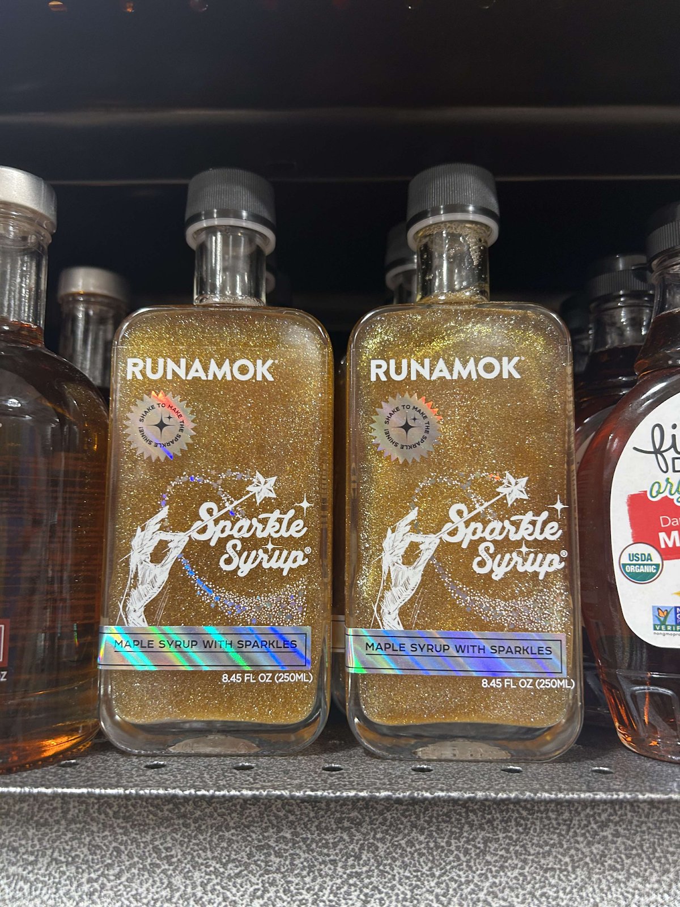

# DormCon GBM 03/13

Date: 13 March 2025  
Location: MacGregor dining room  
Attendees:

:::note

If you find any issues with the meeting minutes, please email
<dormcon-secretary@mit.edu>

:::

## tl;dr

- Exec updates
    - i3 guidelines will be passed on to dorms Soon
    - CPW coming up, dorms can submit funding requests, and should pub for hosts
    - Concord Market is open now\!\!
- Funding request for ESF
    - standard $2000 request, passed by vote
- DormCon Field Day planning
- Concord Market is open\!
    - Some concern over prices, but general happiness with product selection
    - Products will shift with time as they learn what does and doesn’t sell
- Presidents’ updates

## Full minutes

### Exec updates

- UC rep (Eugenie)
    - was going to send out dormspam, but quite hosed :(( relatable
    - will think about it over Spring Break and figure out wording
        - to let people know what’s been happening, why it’s hard to get new
          solutions, hard to take on something like Stata meal swipes :(
        - dining is just complicated \>.\<
- Treasurer (Leo)
    - funding proposal is on agenda :D
- i3 (Jackson)
    - having a meeting with HRS people at 2:30 tomorrow \- happy pie day meeting
      :D \- will get guidelines and timeline then, and pass along to dorm
      presidents/i3 chairs
    - someone (dorm prez or i3) asked about copyrighted music, will ask tomorrow
      and pass along
    - Hanu \- question about i3: was a dorm i3, very involved with music
      situation, what’s the policy?
        - Jackson doesn’t have one yet, will ask in meeting tomorrow afternoon
- Secretary (Lauren)
    - No updates
- UC rep (Jamie)
    - might want more publicity things happening (from Jordan and Ananda)
    - redoing Infinite poster? let them know any other publicity ideas
- CPW (Anthony)
    - has been dying, Gabriel has been doing most work
    - DormCon is splitting $10,000 extra CPW dollars, dorms will request, don’t
      do it late\!
    - also need more hosts, pub to dorm residents\!\!
- Dining (Daniel)
    - Concord Market is open (\!\!\!)
        - will be an agenda item
        - they’ve delayed taking EBT because “smth smth government bad” O.O
        - people struggling with food insecurity should reach out for swipes
    - Two days \- meeting WasteWatchers
    - meeting Peter Cummings
    - meeting FSAT (food security action team)
        - also house dining committees should go
        - scheduled for last Thursday but postponed
    - Office of Sustainability?
        - Maseeh sustainability officer wants food waste bins, struggling to get
          approval
            - residential bins comparable to Random or MacGregor’s
    - talking about running out of food at the end of meals \- Mark is working
      on it
        - tricky trade-off between running out of food/food waste
- Housing (Temkin)
    - Fire Day (\!\!)
        - contact in EHS is on leave, pushed to fall 🙁
        - City of Cambridge also being annoying
            - no one wants to let us have the fire
    - Meeting about upcoming REX changes?
    - Helen sent a NOMS email? (solitude) \- very concerned about supporting
      students
    - URL is getting restructured, might hear info from Tasha and maybe more
      people
    - GRA and HoH hiring is something they want to work on \- very difficult
      logistics for candidates \- something like 16-20 hours of interviews o.o
    - meeting w HRS and RCL tomorrow, mention anything they should bring up in
      prez updates
- President (Jordan)
    - has been out of town for two weeks\!
    - Helen Wang is doing “the Norms Of MIT Solitude”
        - lunch every Friday at 1pm, where they talk about the norms of MIT
          solitude
            - why don’t people talk to their friends anymore 😭
        - “please send me your thoughtful, reflective, and imaginative students”
    - thinking about CPW events (DormCon wants to run them)
    - also planning an inter-dorm field day (more to come\!)

### Funding Request for ESF (from Hanu)

- Budget link:
  [Total Budget Final Version](https://docs.google.com/spreadsheets/d/14_co12ozW-Pc2DqTelUaR85dmkWNPZZbpXPAFl9XaTA/edit?gid=0#gid=0)
    - Last year’s version:
      [DormCon GBM Minutes 2/29/24](https://docs.google.com/document/d/1h7BrPxbbyxwxNKhH0H9IEZA4XniuhK5jFkGOKvmgxPQ/edit)
- esf is celebration of east side campus at MIT
- mostly organized by EC, but also Xi, Pika, Random
- held in DAPER field A \- where EC build was this past REX
- including new additions
    - bouncy castle
    - hair dying
    - good stuff
- Asking for money\!
    - for things that are necessary or useful
    - for DormCon \- specifically security and some set-up costs (e.g., table
      and chairs)
    - budget was sent out at some point, is also in the minutes ^^
    - asking DormCon for **$2000**
- If they don’t end up needing a police detail, they’ll give the money back
- need someone from Bon Appetit to “come check the temperature of our meat”
- also need a police detail
    - apparently sometimes the police detail doesn’t show up, or they don’t
      charge you… just hit or miss?
- unknown whether the police detail was charged last year \- Hanu will check
- how is the event being advertised
    - posters
    - sending emails on dormspam (and to eastside mailing lists)
    - word of mouth
    - This is the same answer as last year, plus the word of mouth part
    - It’s not like there are other ways to advertise
- This is a person vote \- each dorm gets 1 vote, we know the drill
    - Geoffrey has a wheel-spinner
- Vote
    - Maseeh \- yes
    - BC \- yes
    - McCormick \- not present
    - Simmons \- yes
    - Baker \- yes
    - New Vassar \- yes
    - EC \- yes
    - Random \- yes
    - Next House \- not present
    - MacGregor \- yes
- APPROVED :D

### DormCon Field Day

- Or Field Day Brought to You by DormConTM
- competitions of some description, vaguely outside, maybe some stuff inside,
  late April/early May, touch grass
    - “tug of war, tug of war”
    - \*less enthusiastic\* “other field day type games”
- would need at least one contact per dorm, and want to know if this is actually
  a thing people want
- times to not do (e.g., not during ESF)
- thoughtsTM?
    - timing things
        - David \- UA is planning hosting Cultural Festival weekend after CPW
          (on Friday)
        - SpringFest is happening weekend after that
        - springing off of SpringFest (which is the 3rd)?
        - don’t do it that weekend (ring delivery is the 4th)
        - Marathon Monday (day after CPW)
            - upperclassmen would be hosed and maybe doing Marathon Monday
              things…
    - notes on competition style
        - Eugenie \- some form of competition, people compete in teams but earn
          points for their own dorms, inter-dorm competition?
        - what sort of competitions?
            - athletic vs. non-athletic things?
            - thoughts on less athletic events? ring toss, bouncy house
            - “for any Midwesterners in the crowd, corn hole”
                - “you can take my arch from my cold dead hands”
            - “isn’t Baker going to win everything?”
                - “Baker is going to have very low participation” \- baker prez
            - aim for whimsical carnival but with tug-of-war?
            - need to balance the team
                - the other side is also MIT students
                - “you don’t have to be athletic to beat other MIT students”
            - EC likes whimsical carnival but gets a little competitive when it
              comes to other dorms
            - question of how to tabulate scores if we’re making it inter-dorm?
            - interest in having a trophy.
            - second prize is a Blahaj.
        - Last day of classes is May 13th, thoughts on doing May 10th or May
          11th? people might be hosed, but could work?
        - fire hose, but it’s a garden hose 😌
        - could also be fun with no scoring
        - trophy is based on dorm with highest attendance 😭
        - vibes towards scoring?
        - Could get big roll of tickets, and people drop them into buckets for
          their dorms
        - we could put each dorm in charge of an event
        - 12-4pm kind of timeframe
        - location? Killian would be dope but will be getting set up for
          commencement
        - It takes them all of May :( kills All Of The Grass :(
        - people like running events that represent their dorms, could be fun to
          run events that represent the dorm to the Rest of the dorms
        - MacGregor did something similar with entries, worked well\!
        - anyone think it’s not feasible for dorm to be in charge of one event?
        - we get kresge and have a smash tournament inside the auditorium
            - unfortunately, kresge costs a lot to rent
        - they put tents EVERYWHERE \>:(
        - scoring would be fun, but if there’s not a good way to do it without
          lots of people
            - boxes. tickets. events. people.
        - each person gets a ticket for winning an event and can put it in their
          dorm’s box. The people running the events (from each dorm) distribute
          the tickets.
- message Jordan with further thoughts\!\!

### Concord Market\!\!

- “there goes my wallet” \- Leo
- some of it is twice the price of Target \- because organic, not as
  mass-produced…
- very expensive butter, yogurt
- Geoffrey \- sus how people have emphasized affordability, and when Concord
  Market was advertised as new vendor, we emphasized prices, but it’s instead
  like Brother’s Marketplace level, disappointing
- not true for every item
- there are some really expensive things, some really cheap things
    - candy and snacks are cheap
    - feeling like there’s no middle ground
    - prices not yet set in stone
        - they’ve also been changing
        - “reverse inflation?”
        - “Can you barter?”
- feedback form
    - very mixed feedback in terms of price (some people thought it was cheap,
      others thought it was expensive)
- in terms of the things they have?
    - people are happy
    - Ella \- the ratio should be reversed (grocery staples cheap, snacks more
      expensive?)
    - government definition of food desert is lack of affordable, healthy food
      options
- Gabriel got blackberries for $1.99, blueberries for $2.99
    - reasonable price
- Ella \- $5.50 for carton of strawberries
    - not a large variety of fruit
- Gabriel \- there’s cheap tomatoes and expensive tomatoes, but should have more
  of the cheap ones than the expensive ones
- Jackson \- they mostly have fancy brands, which makes it more expensive
- they’ll see what is/isn’t getting bought, will phase out the things that don’t
  get bought
- seem to only have the organic version \- they have two fancy brands instead of
  a fancy brand and a less fancy brand
    - true for some items and not other items
- potatoes were very expensive, only free-range eggs, “not Idaho potatoes”
- Geoffrey \- notably, Concord Market doesn’t accept EBT (government benefits)
  \- sad experience for person who tried to use EBT and couldn’t use it
- “the government is bad right now”
    - couldn’t get SNAP authorization yet :(
    - they’re still waiting on it
- not tax-free
    - talked to Peter Cummings, who said they’d talk to them about it
    - since they’re an external vendor (?)
- product selection
    - how do people feel about brands people haven’t heard of, vs. would want to
      buy?
    - they have lots of things?
        - sparkly maple syrup???  
          \- from Zakiya
    - people want more produce
    - someone bought a coconut
        - “my friend also bought a coconut”
    - nice they have flowers, but not sure if they’ll get bought
    - Ella \- thought selection was good, was impressed by the amount of stuff
      (like a standard grocery store), also pro-more-produce
- produce is hard to find maybe?
    - seemed visible
- three people in form wanted produce
- Jackson \- reiterating that product selection and prices are maybe linked,
  product selection is prioritizing organic brands, etc., hard to decouple
  product selection from price
- large brand selection, but none are recognizable
    - 5 olive brands and 5 caper brands
        - Jordan \- “I don’t know what you’re talking about. I have really
          strong caper preferences”
- Prepared Food
    - Leo \- we don’t have time to buy blocks of cheese, cut them up, and put
      them on crackers
        - Ella disagrees \- has time to cut a block of cheese. preprepared meals
          are fine and good, but angling towards healthy/less waste
        - three pieces of cheese in two layers of plastic is sad
        - frozen meal selection was expensive and limited, wouldn’t spend $9 on
          a frozen meal
    - Zakiya \- had lots of fancy cheeses and teas, different grains of rice,
      different types of nuts, likes having all the options, nothing looking for
      in particular, but would buy things.
    - annoyed they didn’t have non-gummy vitamin supplements
        - Jackson \- wants to add \- also annoyed they only have gummy-like
          vitamins
    - coffee from coffee bar?
        - still getting worked out?
    - sandwiches came in excessive amount of packaging \- wrapped and then also
      in a box
    - not sure why they sell tea for $3.50, Wellbeing Lab is 2 floors above with
      free tea
    - $8 sushi ran out fast \- concern expressed that this could lead to price
      increase (but no current evidence to suggest this is likely)
- Geoffrey \- Enoch suggested Consumer Price Index of prices in Concord Market
    - what is he tracking? inflation?
    - Gabriel \- another suggestion is big spreadsheet to track Concord Market
      vs. other stores
        - lots of work, but could do for a few products, list of staple foods
- Talk to dining chairs or Jordan with more thoughts on Concord Market

### President Updates

- Paola
    - working on merch designs, AD got canvases for murals
    - planning CPW events
    - looking for a snowcone machine
- Helena (Maseeh)
    - working on CPW
    - working on improving basement (redoing gym with house budget)
    - game room, dance room becoming craft space
- Henry and Ella (Random)
    - getting committee chairs to document their positions
        - in case they get hit by buses
    - getting foosball table for basement
    - our roofdeck is becoming tap access :(((((( from 12-6am? it’s quite sad.
    - nothing happened. “they just don’t like us.” \- ella
    - other dorms are not allowed on the roof
    - Random has no other outdoor space (you’re not allowed in the shaft lmao)
    - Temkin will bring up with HRS
    - Ella has a telescope and wants to use it
    - Simmons terraces? apparently a campus-wide thing, not just Random, but
      it’s the first one being implemented, Random’s roofdeck mostly gets used
      from 12-6am :(
    - good intentions, dumb implementation
    - good to have outdoor space for mental health \- this is maybe best bet
      argument
- Hanu (EC)
    - associate HoH interviews (2.5 hours)
    - still trying to collect feedback and present to rest of search committee,
      should be done soon, will have new associate HoH
- Jackson and Eugenie (Simmons)
    - scootahockey is going to happen
    - some problems with laundry \- free laundry is making people use the
      laundry machines a lot
        - things are now malfunctioning, have to run machine 6 times to get
          clothes dry
    - 6/10 New House dryers are nonfunctioning
    - “I guess there’s no such thing as free laundry” \- Jackson
    - McCormick last week had a washer start pouring water out
    - in fairness this is also just the constant state of the Random laundry
      machines… maybe the cost of free laundry…
    - GRA interviews are happening, got people to help run them, on April 5th
      and 6th, realized they don’t have an i3 chair\! that’s not good\! need to
      figure that out.
        - no one ran for i3 chair
    - might reach out to the ones from last year
- Haylea
    - lots of rooming discussions, finalizing rooming discussions/processes
    - working on internal stuff
- Zakiya
    - 2nd elevator just broke, both elevators out of commission :( trying to fix
      that…
    - Next House just also has an infestation problem in country kitchen
        - roaches?? oh no
    - 2 raw sewage leaks in a month (in TFL (?))
        - next to where last GBM was… there’s a dark spot now
    - there’s also mice but everyone has mice
    - talked with dining chairs, trying to get better vegan/vegetarian options,
      trying to model a bit after Vassar, they have dedicated vegan shelf, have
      more options
    - running out of food? happens pretty often in Next (every other time,
      arrives late)
    - got i3 chair, will send to Jackson, getting him onboarded
    - figuring out student groups within dorm, getting website up and running,
      want to have things set by CPW
    - planning formal
- Michaela
    - don’t really have any updates (working on CPW and social events)
    - planning for Top Golf event
- Brendon
    - planning Pie Day for tomorrow
    - CPW planning going well (yay Jamie\!)
    - need details from a few entries, doing a MacGregor-wide event, MacDonald
    - GRA interviews happening, just waiting on C entry
    - AD is leaving at the end of the month :(, will transition to new one
    - in talks of getting makerspace/crafts space, approve from HoH on items,
      finalizing training processes, etc., whether or not to get a sewing
      machine, in talks with McCormick
- Farin
    - something vague about sewing machines, happening
    - also have laundry concern (already brought up)
- Camila
    - piano drop still in the works
    - having an eclipse watch party
    - officially renamed Country Kitchen to Baker Space
        - that’s pretty good
    - got a few people from Baker who forgot to fill out housing form 😭
    - Temkin \- housing being pretty strict on waitlist, most people should get
      off it if they fill it out now (space next year) \- prioritizing rising
      seniors
